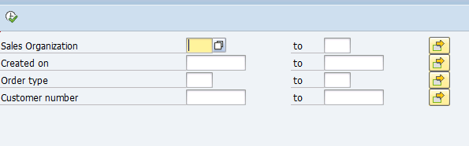
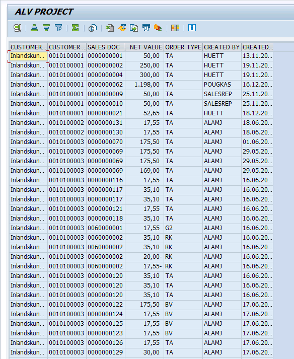

# Sales Order Interactive ALV Report

## Project Overview
**Objective:** Developed a comprehensive ALV report to track Sales Orders by Customer, Date, and Order Type. This tool helps the sales team quickly analyze daily booking data without running standard T-Codes.

## 📸 Output Screenshots

### 1. Selection Screen (Input)
*User filters data by Sales Org, Date Range, or Customer Number.*

### 2. ALV Grid Output (Result)
*Displays joined data from VBAK (Header), VBAP (Item), and KNA1 (Customer).*

## 🛠 Technical Highlights
* **ALV Framework:** Used function module `REUSE_ALV_GRID_DISPLAY`.
* **Data Retrieval:** Implemented `SELECT... FOR ALL ENTRIES` to optimize performance when joining large tables.
* **Modularization:** Logic separated into `INCLUDE` files for declarations, selection screens, and subroutines.
* **Field Catalog:** Manually built field catalog to customize column headers and layout.

---
*Developed by Saad Shaikh | SAP ABAP Fresher*
