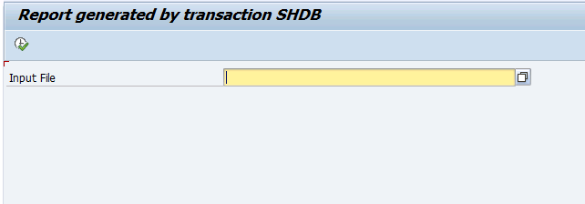
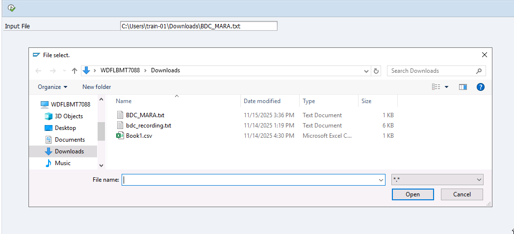
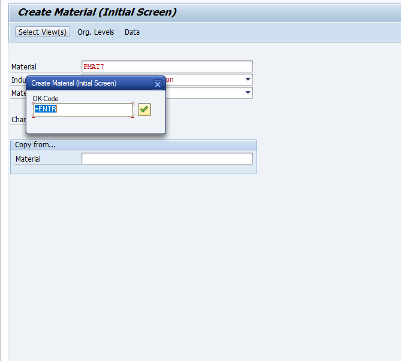
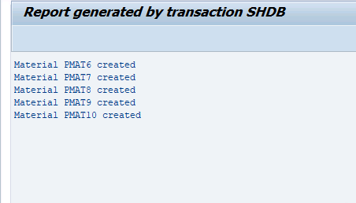

# Sales Order Interactive ALV Report

## 📋 Project Overview
**Objective:** Developed a comprehensive ALV report to track Sales Orders by Sales Organization, Customer, Date, and Order Type. This tool helps the sales team quickly analyze daily booking data without running standard T-Codes.

## 📸 Output Screenshots

### 1. Selection Screen (Input)
*User filters data by Sales Org, Date Range, Order Type, or Customer Number.*


### 2. ALV Grid Output (Result)
*Displays joined data from VBAK (Header), VBAP (Item), and KNA1 (Customer).*


## 🛠 Technical Highlights
* **ALV Framework:** Utilized the function module `REUSE_ALV_GRID_DISPLAY` for standard grid output.
* **Data Retrieval:** Implemented an efficient **`INNER JOIN`** on tables `VBAK` (Header), `VBAP` (Item), and `KNA1` (Customer) to fetch data in a single database hit.
* **Modularization:** Code structure organized using **Subroutines (`FORM`/`ENDFORM`)** for data selection, field catalog building, and display logic.
* **Field Catalog:** Created a dynamic **Macro** (`DEFINE ADD_FIELD`) to build the field catalog manually, reducing code redundancy.

### 💻 Code Snippet: Field Catalog Macro
*Implemented a macro to streamline column definition:*
```abap
  DEFINE ADD_FIELD.
    WA_FIELDCAT-FIELDNAME = &1.
    WA_FIELDCAT-SELTEXT_M = &2.
    WA_FIELDCAT-COL_POS   = &3.
    APPEND WA_FIELDCAT TO IT_FIELDCAT.
    CLEAR WA_FIELDCAT.
  END-OF-DEFINITION.
```

# Material Master Bulk Upload Utility (BDC)

## 📋 Project Overview
**Objective:** Automate the creation of Material Master records (Transaction `MM01`) from legacy flat files. This utility reduces manual data entry time and ensures data consistency across thousands of records.

## 📸 Process & Execution Flow

### 1. Selection Screen
*The user starts by selecting the legacy file path in the input field.*


### 2. File Value Request (F4 Help)
*Integrated `F4_FILENAME` function module to allow users to browse and select files from the local PC.*


### 3. Real-Time Execution (Call Transaction)
*The program executes `MM01` in the background (or Foreground Mode 'A' for debugging), filling screens automatically with file data.*



### 4. Final Success Log
*After processing all records, the report displays a custom log showing the status of every created material.*


## 🛠 Technical Highlights
* **Methodology:** Implemented **Batch Data Communication (BDC)** using the **Call Transaction** method for real-time processing.
* **File Handling:** Utilized function module `GUI_UPLOAD` to parse local flat files into internal tables.
* **Error Handling:** Captured success and error messages using the `MESSAGES INTO` clause with structure `BDCMSGCOLL`.
* **Modularization:** Logic separated into subroutines (`bdc_dynpro` and `bdc_field`) to keep the code clean and reusable.

### 💻 Code Snippet: Call Transaction Logic
*The core logic that processes the transaction and captures logs:*
```abap
  " Populate the BDC Data table
  PERFORM bdc_dynpro USING 'SAPLMGMM' '0060'.
  PERFORM bdc_field  USING 'RMMG1-MATNR' wa_mat-matnr.
  PERFORM bdc_field  USING 'RMMG1-MBRSH' wa_mat-mbrsh.
  PERFORM bdc_field  USING 'RMMG1-MTART' wa_mat-mtart.

  " Execute MM01 immediately
  CALL TRANSACTION 'MM01' USING it_bdcdata 
                          MODE 'A'       " Display All Screens (for debugging/demo)
                          UPDATE 'S'     " Synchronous Update
                          MESSAGES INTO it_messtab.

```

---
*Developed by Saad Shaikh | SAP ABAP Fresher*


